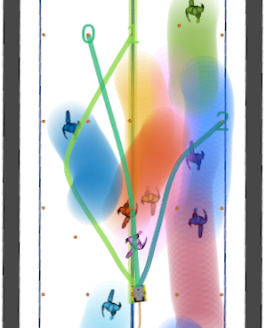

# SHINE: Social Homology Identification for Navigation in Crowded Environments

This repo provides the code of the work for out paper SHINE: Social Homology Identification for Navigation in Crowded Environments, published in the International Journal of Robotics Research (IJRR) in 2025.

# [Paper](https://arxiv.org/pdf/2404.16705) || [Video](https://www.youtube.com/watch?v=pOzRyWBk7MI)

## Abstract
Navigating mobile robots in social environments remains a challenging task due to the intricacies of human-robot interactions. Most of the motion planners designed for crowded and dynamic environments focus on choosing the best velocity to reach the goal while avoiding collisions, but do not explicitly consider the high-level navigation behavior (avoiding through the left or right side, letting others pass or passing before others, etc.). In this work, we present a novel motion planner that incorporates topology distinct paths representing diverse navigation strategies around humans. The planner selects the topology class that imitates human behavior the best using a deep neural network model trained on real-world human motion data, ensuring socially intelligent and contextually aware navigation. Our system refines the chosen path through an optimization-based local planner in real time, ensuring seamless adherence to desired social behaviors. In this way, we decouple perception and local planning from the decision-making process. We evaluate the prediction accuracy of the network with real-world data. In addition, we assess the navigation capabilities in both simulation and a real-world platform, comparing it with other state-of-the-art planners. We demonstrate that our planner exhibits socially desirable behaviors and shows a smooth and remarkable performance.

<p align="center">
  
</p>

## Installation ##

The setup is prepared for ROS noetic and Ubuntu 20.04.

### Cloning the MPC ###
In your ROS1 catkin workspace (`ws`) go to `ws/src/` and clone:
- The MPC.
- The guidance planner (can also be used standalone)
- A tools package for visualization and analysis
- The Jackal simulator
- The pedestrian simulator

```
git clone https://github.com/dmartinezbaselga/shine-lmpcc.git
git clone https://github.com/dmartinezbaselga/shine-guidance_planner.git
git clone -b legacy https://github.com/oscardegroot/ros_tools.git
git clone https://github.com/oscardegroot/jackal_simulator.git
git clone -b learning-homology https://github.com/oscardegroot/pedestrian_simulator.git
git clone -b legacy https://github.com/oscardegroot/roadmap.git
```

From `ws/` install dependencies.

```
rosdep install --from-paths src --ignore-src -r -y
```

Now, select the system to run the controller for.

```
cd src/lmpcc/lmpcc
chmod +x 01_set_system.sh
./01_set_system.sh Jackal
```

The optimization solver is generated in Python. We offer a virtual environment that works with Python3.8, to initialize it run:

```
./00_setup_solver_venv.sh
```

To generate the solver you need a Forces Pro license, you can request a free academic licenses here: [https://www.embotech.com/products/forcespro/overview/](https://www.embotech.com/products/forcespro/overview/).

Place the Forces Pro client in `~/forces_pro_client` or add its path to `$PYTHONPATH`. More details are given at the end of this readme.

To generate the solver, run

```
./02_generate_solver.sh True
```

Finally, build the package and dependencies

```
catkin build lmpcc
```

### Install FORCES PRO (Details)
Guide from the manual [here](https://forces.embotech.com/Documentation/installation/python.html). 
To set up your Forces Pro license, follow these steps:
- Obtain a license from [the Embotech site](https://www.embotech.com/license-request) (this takes about half a week)
- When your license is approved, assign your license to your computer. Make sure to use the username of your account.
- Download the fingerprinter and run it on your system. Paste the fingerprint into your forces license.
- Download the forces client and extract the files to (e.g., `~/forces_pro_client/`). 
- If you place it somewhere else, you can set the specific path (e.g., in `~/.bashrc`): `export PYTHONPATH="${PYTHONPATH}:<your path to forces>"`.

### Cloning  SHINE Learning server ###
Go to `ws/src` and clone this package:
```
git clone --recurse-submodules https://github.com/dmartinezbaselga/SHINE
```

### Setting SHINE Python environment ###
First, we'll create a conda environment to hold the dependencies.
```
conda create --name shine python=3.9 -y
source activate shine
pip install -r requirements.txt

# See note in requirements.txt for why we do this.
pip install --no-dependencies l5kit==1.5.0
```

Lastly, install `trajdata` and `trajectron` (this repository) with
```
cd unified-av-data-loader
pip install -e .

cd ..
pip install -e .
```

If you now check `pip list`, you should see the above dependencies installed as well as `trajdata` and `trajectron`.

### Data Setup ###

We use [trajdata](https://github.com/NVlabs/trajdata) to manage and access data in this project, please follow the [dataset setup instructions](https://github.com/NVlabs/trajdata/blob/main/DATASETS.md) linked in its README (particularly for ETH/UCY Pedestrians).

## Model Training ##

This repository makes use of [Weights & Biases](https://wandb.ai) for logging training information. 

You first need to launch the guidance server:
```
roslaunch guidance_planner guidance_server.launch
```
Then, use the lines of the script `experiments/pedestrians/train_guidance.sh`.

For testing the predicting accuracy, launch again the guidance server:
```
roslaunch guidance_planner guidance_server.launch
```
Then, use python `test_guidance.py` uncommenting the ones that you want to test.

For running the simulator, use: 
```
roslaunch lmpcc jackalsimulator_pedsim.launch
```
Then, you can start sending goals to the robot using RVIZ.

## Citation
If you use this work in your own research or wish to refer to the paper's results, please use the following BibTeX entries.
```bibtex
@article{martinez2025shine,
  title={SHINE: Social Homology Identification for Navigation in Crowded Environments},
  author={Martinez-Baselga, Diego and de Groot, Oscar and Knoedler, Luzia and Riazuelo, Luis and Alonso-Mora, Javier and Montano, Luis},
  journal={The International Journal of Robotics Research},
  doi = {10.1177/02783649251344639},
  year={2025}
}
```

## Bug Reports and Support
For issues related to the work, please contact:
- Diego Martinez-Baselga: `diegomartinez@unizar.es`

## Acknowledgements
This work was supported by MICIU/AEI/10.13039/501100011033 and ERDF/EU under grants (PID2022-139615OB-I00 and PRE2020-094415), from the Government of Aragón under grant DGA T45-23R, from the European Union’s Horizon 2020 research and innovation programme under grant agreement No. (101017008), and from the European Union ERC, INTERACT, (101041863). Views and opinions expressed are however those of the author(s) only and do not necessarily reflect those of the European Union or the European Research Council Executive Agency. Neither the European Union nor the granting authority can be held responsible for them.

### Attribution
The network developed in SHINE builds on the code from the works [Expanding the Deployment Envelope of Behavior Prediction via Adaptive Meta-Learning](https://arxiv.org/abs/2209.11820) by Boris Ivanovic, James Harrison, and Marco Pavone as well as an updated version of [Trajectron++: Dynamically-Feasible Trajectory Forecasting With Heterogeneous Data](https://arxiv.org/abs/2001.03093) by Tim Salzmann\*, Boris Ivanovic\*, Punarjay Chakravarty, and Marco Pavone (\* denotes equal contribution).

### Licensing
This project uses a dual-licensing structure:
1. **Apache License 2.0**:
   - Applies to the original code from the Trajectron++.
   - See [LICENSE](https://www.apache.org/licenses/LICENSE-2.0) for the full text.
2. **GNU Affero General Public License, version 3 (AGPL-3.0)**:
   - Applies to all modifications and new code developed as part of SHINE.
   - See [LICENSE](https://www.gnu.org/licenses/agpl-3.0.html#license-text) for the full text.

